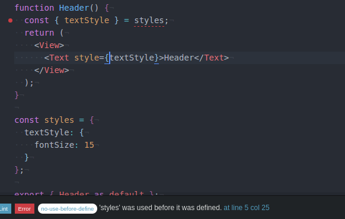

### Code/technical issues

1. [no-use-before-define](http://eslint.org/docs/rules/no-use-before-define) doesn't like the common pattern of putting styles in react-native



This issue was very helpful :https://github.com/Intellicode/eslint-plugin-react-native/issues/22

**Solution:**
I could define my styles on top of the file but I prefer styles to be declared at the bottom of the file.

So I went for: 
- disable ```no-use-before-define``` just like react-native team do: https://github.com/facebook/react-native/blob/8baaad9b0fbda2b02bb1834452aa63cac7910dc5/.eslintrc#L162
