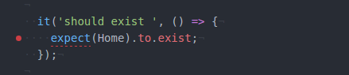
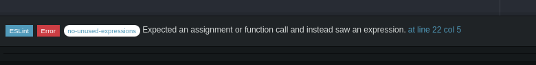

### Strange errors

1.```no-named-as-default``` with React, Redux

Error:


**Solution**
- disable the rule in .eslintrc :
```js
"import/no-named-as-default": 0
```

Reference:
- https://github.com/benmosher/eslint-plugin-import/issues/544
- https://github.com/benmosher/eslint-plugin-import/issues/468

2.Missing propTypes validation of children

**Solution**

```js
const propTypes = {
  children: PropTypes.node
};
```

Reference:
-- https://github.com/yannickcr/eslint-plugin-react/issues/7

3.Error: ```no-unused-expressions``` on ```expect(Obj).to.exit``` using Chai and eslint

Issue:



**Solution**
-  ignore eslint in test folder (for now till better solution) by :
  - create ```.eslintignore``` and add folder test to it

Reference:
- https://github.com/eslint/eslint/issues/2102
