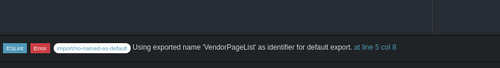

### Strange errors

1. ```no-named-as-default``` with React, Redux

Error:


**Solution**
- disable the rule in .eslintrc :
```js
"import/no-named-as-default": 0
```

Reference:
- https://github.com/benmosher/eslint-plugin-import/issues/544
- https://github.com/benmosher/eslint-plugin-import/issues/468
