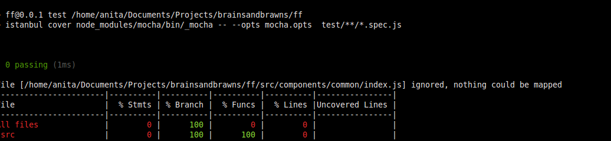
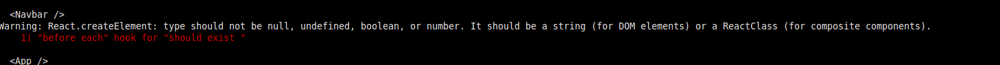

#### Testing issues and solutions

1. Testing main App component:

```js
describe('<App />', () => {
  it('should render Header component', () => {
    const wrapper = shallow(<App />);
    expect(wrapper.find(Header)).to.have.length(1);
  });
});
```

Test was broken with:

```
TypeError: Cannot read property 'propTypes' of undefined
```

**Solution**

This article was helpful: https://kyrisu.com/2016/01/31/unit-testing-react-native-components-with-enzyme-part-1/ which points to https://gist.github.com/jmreidy/4145809229195441d4d4 at the end I have used npm module to mock React-Native components:
https://github.com/lelandrichardson/react-native-mock

In test/setup.js which has to run before all your tests, require the module :

```js
// This will mutate `react-native`'s require cache with `react-native-mock`'s.
require('react-native-mock/mock'); // <-- side-effects!!!

```

2. Istanbul does not map anonymous export



Also error:

```
"SyntaxError: 'import' and 'export' may appear only with 'sourceType: module'"
```

- https://github.com/gotwarlost/istanbul/issues/598
- https://github.com/eslint/eslint/issues/4787
- https://github.com/gotwarlost/istanbul/issues/598

Not yet solution!!!

3. Error:



Typical React error!
Meaning: You trying to test component which is undefined. The problem is with your export/import statements.

**Solution**
You need to export pure raw React component for testing purpose only.

```js
// esport raw React component then you can test it
export class MyComponent extends ....

export default MyComponent ...

```

in your test file:

```js
import { MyComponent } from ....
```
